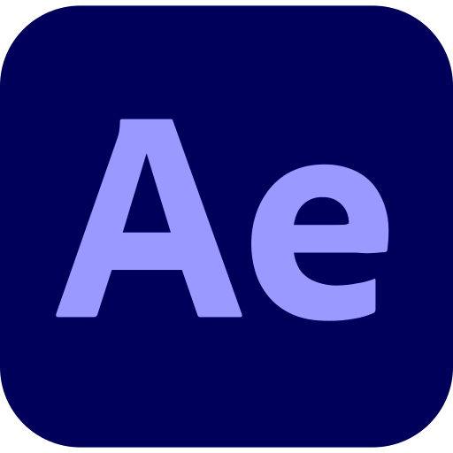

# <h1 align="center"><b>Hello World ! 👋</b></h1>

| Developer | Computer Science | Designer |
| --------- | ---------------- | -------- |

## <pre align="center">🧰 Tech Stack</pre>

## <pre align="center">🛠️ Tools</pre>

## <pre align="center">📊 GitHub Stats</pre>

## <pre align="center">💬 Let’s Connect</pre>

  
  
  

---
