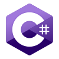

<h1 align="center"><strong>Hello World ! 👋</strong></h1>
<h3 align="center">It's Fahadh</h3>

| Developer | Computer Science student | Designer |
| --------- | ------------------------ | -------- |

## <h3 align="center">🧰 Tech Stack & Tools</h3>

---

## <h3 align="center"> 📊 GitHub Stats <h3>

## 💬 Let’s Connect

   
   
   

---
